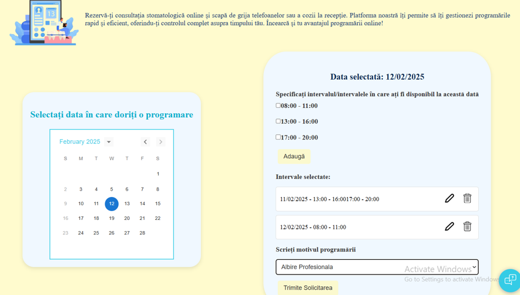
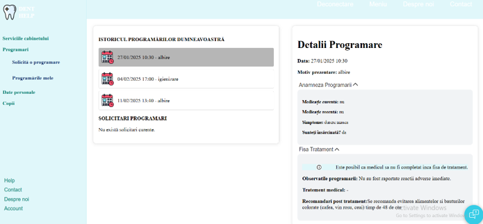
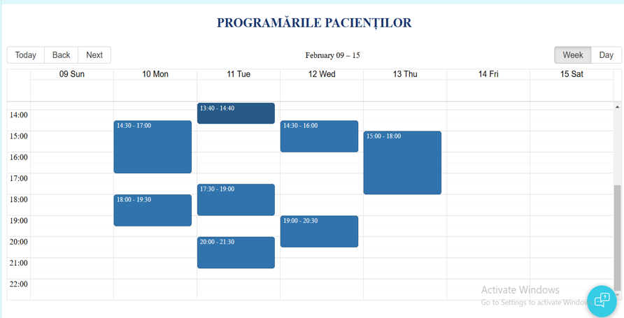
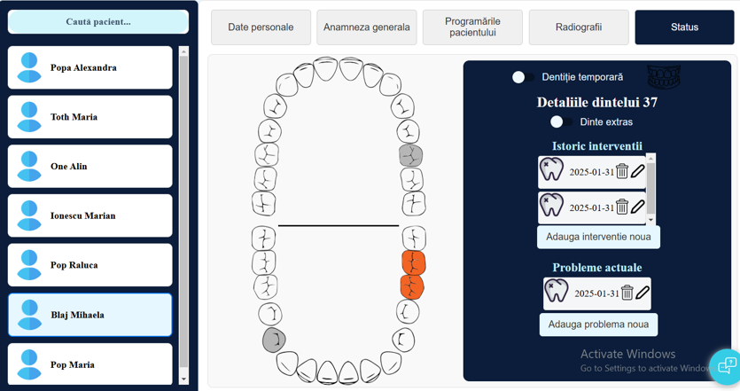
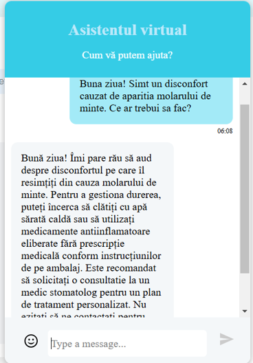

# DentHelp
Aplicația propusă reprezintă o soluție pentru eficientizarea acestor activități prin implementarea a diverse funcționalități adresându-se atât medicilor stomatologi, cât și pacienților:
  - Manipularea electronică a datelor pacienților
  - Programări online și gestionarea vizitelor
  - Acces la istoricul vizitelor și al procedurilor efectuate

## Arhitectura Aplicatiei:
Aplicația este construită folosind arhitectura 3-layer (trei straturi), fiecare strat având o responsabilitate specifică:
  - **Presentation Layer**: în cadrul aplicației acest nivel îl reprezintă interfața cu utilizatorul (construită folosind framwork-ul React)
  - **Business Logic Layer**: responsabil pentru implementarea regulilor și proceselor care definesc modul în care funcționează sistemul (pentru aplicația “DentHelp” acest strat este implementat folosind limbajul 
 de programare Java împreună cu SpringBoot)
  - **Data Access Layer**: responsabil pentru interacțiunea cu baza de date (baza de date folosită în aplicație este de tip MySql)

## Cazuri de utilizare ## 

## Functionalitati
  ### Realizarea unei programări
  Pentru ca un pacient să efectueze o programare, acesta trebuie să facă o solicitare către medicul stomatolog care să conțină intervalele de timp și data în care acesta este disponibil, dar și motivul programării.
Acesta poate alege mai multe zile în care este disponibil și intervalul/intervalele orare pentru fiecare dintre aceste zile.

  ### Confirmarea/respingerea unei solicitări pentru programare
Medicul are posibilitatea de a vedea toate solicitările de la toți pacienții și după analiza acestora își poate organiza programul în funcție de criteriile dorite. În momentul în care medicul accepta sau respinge o solicitare pacientul este informat despre alegerea acestuia, iar în cazul în care solicitarea a fost acceptată programarea se realizează automat.
  

  ### Istoricul programărilor

  Pacientul are acces la întregul istoric al programărilor, inclusiv cele viitoare, dar și la solicitări.  Acesta poate vedea detaliile programării, recomandările medicului și poate completa anamneza programării.   Dacă programarea nu a avut loc încă, atunci pacientul are posibilitatea de a o anula sau de a anunța o întârziere. Petru fiecare din cele două acțiuni medicul primește câte o notificare.
  

  ### Vizualizarea programărilor - medic
  Medicul are un calendar în care poate vizualiza toate programările dintr-o anumită perioadă. Fiecare programare conține numele pacientului, ora programării și posibilitatea de a anula programarea. 
  Din această secțiune medicul poate adăuga o programare nouă selectând un interval de timp, specificând pacientul și motivul programării.

  

  ### Starea dentara a pacientului
  Atât medicul cât și pacientul au acces la starea dentară generală a pacientului.
  Medicul poate alege din listă un pacient pentru care dorește să vizualizeze anumite informații. Din reprezentarea vizuală a dinților medicul poate alege un dinte și va observa informații despre acesta. Poate să   adauge/șterge/editeze o intervenție sau o problemă. În momentul în care se adaugă o problemă dintele se colorează cu portocaliu. Pentru a marca faptul că un dinte este extras acesta este colorat cu gri.
  

  ### CHATBOT – Asistent virtual
  Aplicația are implementat un asistent virtual care să răspundă la întrebările medicului sau a pacientului.  Acesta oferă răspunsuri doar la întrebările din spectrul dentar sau despre cabinet. Oferă sfaturi        pacienților, însă recomandă tot timpul pacientului să ceara sfatul medicului.
  Este implementat folosind un API de la OpenAI.
  
